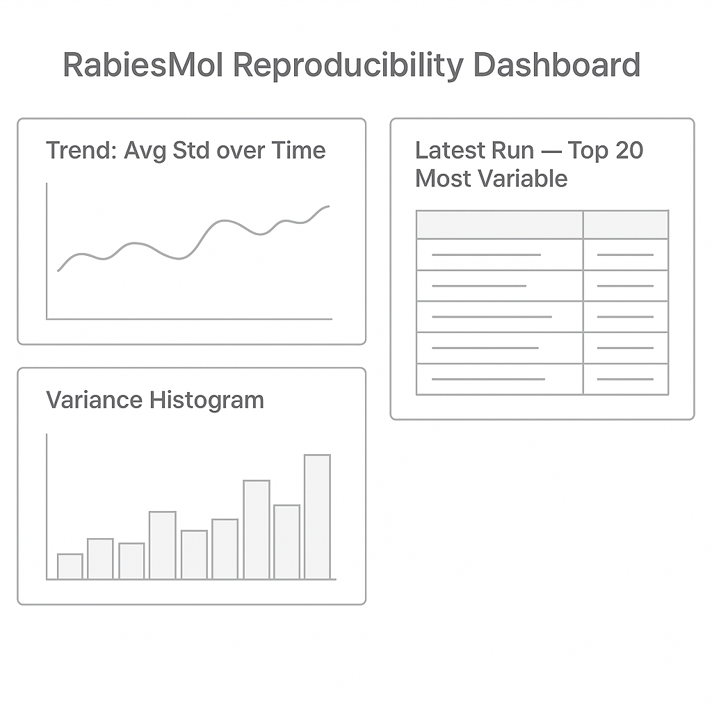

# RabiesMolScreen

Pipeline for molecular screening against RABV (Rabies Virus) targets.

## Overview

RabiesMolScreen is an open-source pipeline for virtual screening of small molecules against rabies virus proteins (e.g., L and P). It integrates molecular docking (AutoDock Vina), cheminformatics (RDKit), and optional ML rescoring.

## Quickstart (End-to-End Example)

```bash
# 1. Setup environment
mamba env create -f environment.yml
mamba activate rabiesmol

# 2. Download example proteins (stubbed)
make download

# 3. Prepare proteins and ligands
make prepare

# 4. Run docking
make dock

# 5. Rescore (if implemented)
make rescore

# 6. Generate report
make report
```

### Expected Output

- `data/proteins/` — input protein structures
- `data/ligands/` — input ligands
- `data/docking/` — docking results (.pdbqt)
- `data/results/` — rescoring results (if available)
- `reports/html/` — generated HTML reports

## Makefile Targets

| Target   | Description |
|----------|-------------|
| setup    | Install conda env |
| download | Fetch proteins (stub) |
| prepare  | Prepare proteins/ligands |
| dock     | Run docking |
| rescore  | Rescore results |
| report   | Generate HTML report |
| clean    | Clean intermediate files |

## Dependencies

See [`docs/concept.md`](docs/concept.md) for a roadmap and full dependency table.

## License

MIT


## Target Proteins: RABV L and P

The primary targets in this project are the **L** (RNA-dependent RNA polymerase) and **P** (phosphoprotein) proteins of the rabies virus (RABV).

### Data Sources

- **AlphaFold DB** — predicted protein structures for RABV proteins by UniProt IDs
- **Protein Data Bank (PDB)** — experimentally solved structures (if available)

Structures are stored with:
- **FASTA** sequences
- **PDB** coordinate files
- **metadata.json** containing download date, UniProt ID, and source

### Multiple Conformations

The pipeline supports:
- Different **domains** of the L protein (polymerase domains)
- L–P complexes for interface docking

See [`scripts/fetch_structures.py`](scripts/fetch_structures.py) for automated retrieval.


## Defaults & Reproducibility

Default decisions are tracked in `config/defaults.yaml` (pH, salts, grid box, exhaustiveness, seeds, structural waters). Edit this file to change project-wide defaults.

## Privacy & Licensing

All protein structures and compound examples are sourced from **public/open** databases (AlphaFold DB, UniProt; example ligands are simple SMILES provided here for demonstration). External tools/libraries (RDKit, OpenBabel, AutoDock Vina, fpocket, DeepChem, etc.) are used under their respective licenses; see their documentation for details.

## Multi-arch Notes

This repository's Docker workflow builds images for both **linux/amd64** and **linux/arm64** architectures.

### Usage

```bash
# Pull the latest multi-arch image from GHCR
docker pull ghcr.io/<org_or_user>/rabiesmol:latest

# Run on your architecture (Docker will auto-select correct variant)
docker run -it --rm ghcr.io/<org_or_user>/rabiesmol:latest
```

### Local Multi-arch Build

```bash
# Enable buildx
docker buildx create --use

# Build for amd64 and arm64 locally
docker buildx build --platform linux/amd64,linux/arm64 -t rabiesmol:multiarch .
```

---

**Suggestions for improvement:**
1. Add arm/v7 support if targeting Raspberry Pi or embedded devices (possible, but check toolchain support for RDKit/Vina).
2. Create a lightweight "runtime" image (e.g., based on `python:3.10-slim`) with only runtime deps for deployment.
3. Provide prebuilt tags for specific tool versions (e.g., `vina1.2.5-rdkit2023.03`).
4. Automate GHCR description sync with README section using `docker/metadata-action`.

## Runtime Docker Image

A lightweight runtime image `Dockerfile.runtime` is available based on `python:3.10-slim`.
It contains only runtime dependencies (no build tools) for deployment.

### Build and Run Runtime Image

```bash
docker build -f Dockerfile.runtime -t rabiesmol:runtime .
docker run -it --rm rabiesmol:runtime
```

---

**Suggestions for improvement:**
1. Publish runtime image to GHCR alongside full image.
2. Provide separate tags for runtime (e.g., `runtime-latest`, `runtime-vina1.2.5-rdkit2023.03`).
3. Add automated tests in CI to verify runtime image basic commands.

### Runtime Image

A lightweight **runtime** image is also built and pushed with tags:
- `ghcr.io/<org_or_user>/rabiesmol:runtime`
- `ghcr.io/<org_or_user>/rabiesmol:runtime-vina1.2.5-rdkit2023.03`

Intended for post-processing and reporting without full docking toolchain.

**Suggestions for improvement:** 
- Consider splitting runtime into `-report` (with RDKit/matplotlib) and `-api` (minimal, for serving results).

### Versioned Tags

The CI publishes versioned tags like **`vina1.2.5-rdkit2023.03`** so you can pin toolchains across runs.

**Suggestions for improvement:** 
- Add matrix builds over multiple Vina/RDKit versions and test against the same dataset to check reproducibility.

### Supply Chain Security

The CI workflow now generates:

- **SBOM** (CycloneDX JSON) for the built image — lists all dependencies with versions.
- **SLSA Provenance** — attestation of the build process for supply-chain security.

Both artifacts are uploaded to the GitHub Actions run and can be stored or published as needed.

**Suggestions for improvement:**
- Publish SBOM and SLSA provenance alongside the image in GHCR (attach as OCI artifacts).
- Periodically scan the SBOM with vulnerability scanners (Grype, Trivy) as part of CI.
- Sign provenance with Sigstore/Cosign for verifiable builds.

## Supply-chain: SBOM & SLSA Provenance

- Docker builds include **SBOM** (CycloneDX) and **provenance** attestations.
- SBOMs are uploaded as workflow artifacts; images also carry SBOM metadata via Buildx.
- SLSA provenance attestations are generated and attached to the build digests.

**Suggestions for improvement:**
1. Sign images with **Sigstore Cosign** and enforce verification in deploy (policy-controller/OPA).
2. Publish SBOMs to a dedicated registry or attach as OCI artifacts linked to image digest.
3. Fail CI on **critical CVEs** by adding `trivy` scan stage with severity gates.
4. Pin base images by **digest** (not just tag) to reduce supply-chain drift.

## Security Scanning & Signing

- **Trivy** scans run on both main and runtime images with `CRITICAL,HIGH` severity gates.
- Builds fail if critical vulnerabilities are found (unless marked `--ignore-unfixed`).
- **Cosign** signs both images using a private key from repository secrets.

**Suggestions for improvement:**
1. Add scheduled Trivy scans (e.g., weekly) on the latest images to detect newly disclosed CVEs.
2. Integrate Cosign **keyless signing** via OIDC to avoid secret management.
3. Add `cosign verify` step in deploy pipelines to enforce signature presence.
4. Include SBOM digest in Cosign annotations for end-to-end artifact traceability.

## Security: Scanning & Signing

### Trivy Vulnerability Scans
The Docker workflow scans both the main and runtime images with **Trivy** and **fails CI on CRITICAL** issues.

**Suggestions for improvement:**  
- Add a scheduled weekly scan (`on: schedule`) to detect drift in base images/libraries even without code changes.

### Cosign Signing (Keyless/OIDC)
Images are **signed with Cosign** using GitHub OIDC (keyless). Digests are signed right after build.

Verify locally:
```bash
cosign verify ghcr.io/<org_or_user>/rabiesmol@<digest>
```

**Suggestions for improvement:**  
- Add a *policy gate* (e.g., Kyverno/Connaisseur) in your cluster to **only admit signed images** from trusted identities.

## Reproducibility Matrix

A dedicated workflow builds a small matrix of **Vina/RDKit** versions and runs the mini-docking to measure score variance. Artifacts include per-run CSVs and an aggregated `variance_summary.csv` (mean/std per ligand).

**Suggestions for improvement:**
- Extend the matrix with **OpenBabel** versions and different **grid-box** sizes to evaluate sensitivity.
- Store variance summaries in a dedicated branch (e.g., `gh-pages`) and render a small dashboard.

## Bootstrap

Use `scripts/bootstrap.sh` to check Git LFS, install pre-commit hooks, set up environment, and run a first E2E demo.

**Suggestions for improvement:**
- Make the bootstrap script idempotent and interactive (ask before heavy steps), and add Windows/PowerShell variant.

## Reproducibility Matrix: Multi-arch & Visualization

The reproducibility matrix workflow now:
- Builds/test runs for **linux/amd64** and **linux/arm64**.
- Generates a **variance_distribution.png** plot showing the histogram of consensus score std. deviations.

**Suggestions for improvement:**
- Add **statistical tests** (e.g., paired t-test) between amd64 vs arm64 runs to detect architecture-specific drift.
- Store generated plots in a public dashboard (e.g., GitHub Pages) for easy monitoring over time.

### Reproducibility across Architectures

The matrix workflow now tests **linux/amd64** and **linux/arm64** (via QEMU) and generates a histogram (`variance_hist.png`) of consensus score variability.

**Suggestions for improvement:**
- Add **arm/v7** to the reproducibility matrix if runtime performance allows (longer runs under QEMU).
- Publish the histogram and CSV to a **GitHub Pages** dashboard for quick visualization across runs.

## GitHub Pages Dashboard

The reproducibility workflow now publishes a **static dashboard** to **GitHub Pages** with:
- `variance_summary.csv` preview,
- static histogram,
- interactive Plotly scatter (std vs mean).

**Suggestions for improvement:**
- Persist historical runs (e.g., keep `variance_summary_<date>.csv`) and plot **trends over time**.
- Add **filters** (by platform/version) and a small **search** box for ligand IDs.

### Historical Trends

The Pages dashboard now keeps **dated variance snapshots** in `history/` and builds a **trend chart** (average std per run).

**Suggestions for improvement:**
- Add **per-platform/per-version** trend lines (multiple series).
- Keep a **rolling window** (e.g., last 12 weeks) and compress older CSVs to `.gz` to reduce repo bloat.

### Metadata in Trends

The variance history now includes `vina_version`, `rdkit_version`, and `platform`, enabling filtering in the dashboard.

**Suggestions for improvement:**
- Add `git_commit` of the run for traceability.
- Show multiple trend lines (different colors per platform/version) in one chart for direct comparison.

### Metadata in Variance History

The reproducibility history now stores **vina**, **rdkit**, and **platform** for each run and exposes **filters** on the dashboard.

**Suggestions for improvement:**
- Add **toolchain digest** (exact conda refs) to history for perfect provenance.
- Export a compact **JSON** alongside CSV for faster client-side loading.

### Provenance metadata

Each variance snapshot now includes:
- **git_sha** of the workflow run,
- **image_id** (Docker image ID used for the mini run).

**Suggestions for improvement:**
- When pushing to a registry in the matrix, record the **OCI digest** (`repo@sha256:...`) for canonical provenance.
- Attach the SLSA **attestation link** per run to the dashboard for one-click verification.


## 📷 Screenshots

**Dashboard Overview**  


**Trend Graph**  


### Auto-updated Screenshots

The images in README are automatically replaced after a successful **Reproducibility Matrix** run with the latest artifacts (histogram and trend).

**Suggestions for improvement:**
- Store thumbnails with **content hashes** in filenames to avoid stale caches on GitHub CDN.
- Add a safeguard requiring **manual approval** before committing to `main` if the diff is large.
