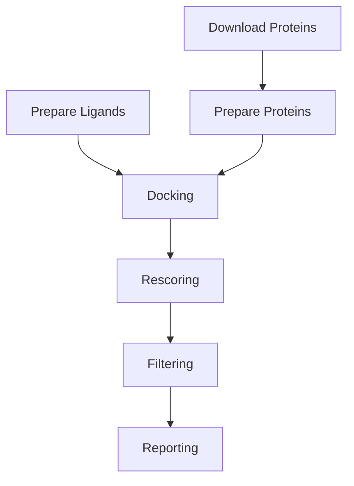

# RabiesMolScreen Concept

## Roadmap

1. **Protein Structure Retrieval** — Download or predict structures of RABV targets.
2. **Ligand Preparation** — Standardize and protonate compounds.
3. **Protein Preparation** — Remove waters, add hydrogens, convert to PDBQT.
4. **Docking** — AutoDock Vina-based screening.
5. **Rescoring** — ML-based rescoring (RF-Score, GNINA).
6. **Filtering** — ADMET and CNS penetration filters.
7. **Reporting** — Summary tables, plots, hit lists.

## Pipeline Diagram

## Dependency Table

| Tool / Library  | Version | Purpose |
|-----------------|---------|---------|
| RDKit           | 2023.03.3 | Cheminformatics |
| OpenBabel       | 3.1.1 | File format conversion |
| AutoDock Vina   | 1.2.5 | Docking |
| DeepChem        | 2.7.1 | ML rescoring |
| Pandas          | 2.1.4 | Data analysis |
| NumPy           | 1.26.2 | Math |
| scikit-learn    | 1.3.2 | ML utilities |
| Matplotlib      | 3.8.2 | Plotting |
| Seaborn         | 0.13.1 | Visualization |
| Loguru          | 0.7.2 | Logging |
| Pydantic        | 2.5.3 | Config validation |
